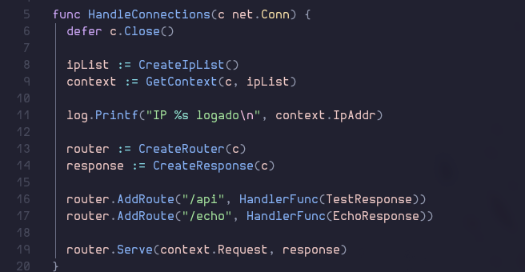

# Server HTTP em Golang
  Uma implementação de um Servidor HTTP para entender melhor como comunicação web funciona por baixo dos panos.

## Sobre o Projeto
  Este projeto tem como foco estabelecer um servidor respeitando a norma de implementação **RFC 9112** do modelo **HTTP/1.1**

### Funcionalidades
- **HTTP Parsing:** Parsing dinâmico da requisição, provendo o acesso a todo o contexto da requisição para manipulação do usuário
- **Rate Limmits:** Bloqueio por IP em caso de excesso de tentativas de acesso em um determinado intervalo de tempo
- **Formato JSON:** Processamento de requests e respostas apenas em formato JSON(por enquanto)
- **Handlers Assíncronos:** Processamento assíncrono com goroutines dedicadas para cada interação

## Descrição
### Por que Golang?
  Minha ideia era realizar a implementação pensando em como minimamente seria se eu recebesse essa task em produção. Devido às goroutines e a arquitetura de Golang voltada para justamente esse tipo de atividade, julguei que seria a linguagem ideal para lidar com regras de mais baixo nível.

### Qual a ideia real desse projeto?
  Principalmente desvendar a "mágica" por trás do protocolo que utilizo todos os dias, meu foco é entender bem o que acontece para ter mais conhecimento ao voltar as tarefas do cotidiano

### Testado para Produção?
  Não, esse servidor não deve ser usado para produção, por mais que eu me guie nesse sentido, diversos testes e validações não serão feitos

## Por dentro do código
### Exemplo de sintaxe

- #### HandleConnections:
  É a função principal executada pela goroutine na função principal, ela recebe o objeto net.Conn disponível ao estabelecer a conexão TCP

- #### IpList:
  Objeto responsável por gerenciar as conexões e validar os limites de requisição de cada endereço IP

- #### GetContext:
  Com o objeto net.Conn e o IpList, faz uma validação interna e cria um objeto com todas as informações da requisição

- #### Router e Response:
  Router é o objeto responsável por gerenciar as rotas e funções a serem executadas e Response é o objeto utilizado para devolver respostas HTTP formatadas

- #### AddRoute:
  Este método de router cria de maneira modular endpoints e designar funções para execução do endpoint, qualquer função pode ser usada, desde que ela receba o objeto Request(Dentro de context) e o objeto Response

- #### Serve:
  Este método de router é o que verifica se o endpoint solicitado existe, e caso exista executa a função designada para o mesmo

## Considerações Finais
  A ideia principal era criar um servidor modular mas sem muitas abstrações, ainda faltam algumas outras funcionalidades mas o básico de comportamento que o servidor deve ter já está definido.
  Foi bastante desafiador mas tenho certeza que isso me torna um profissional melhor a partir de hoje.
